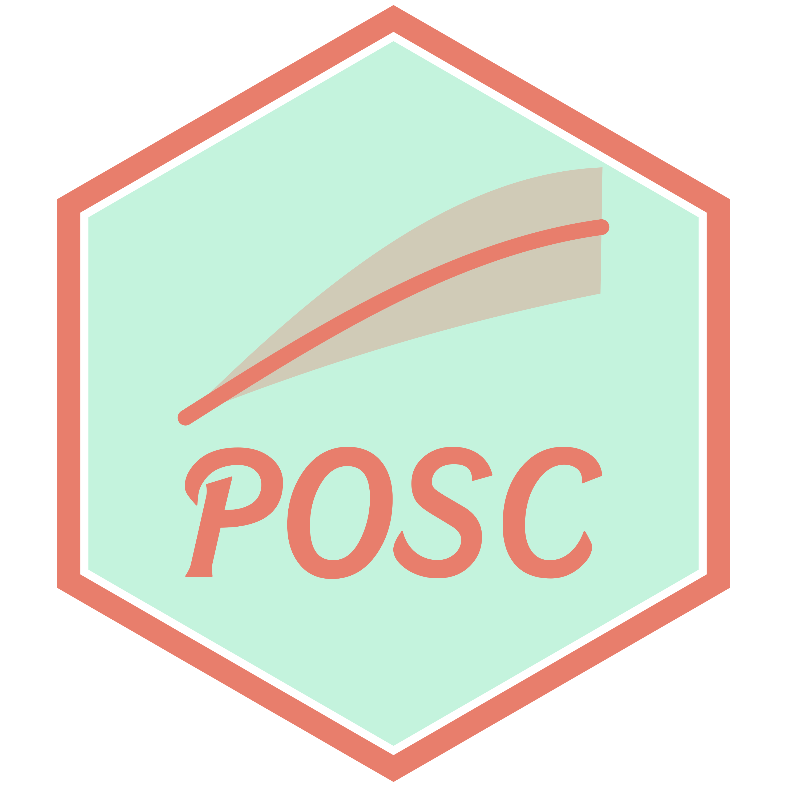
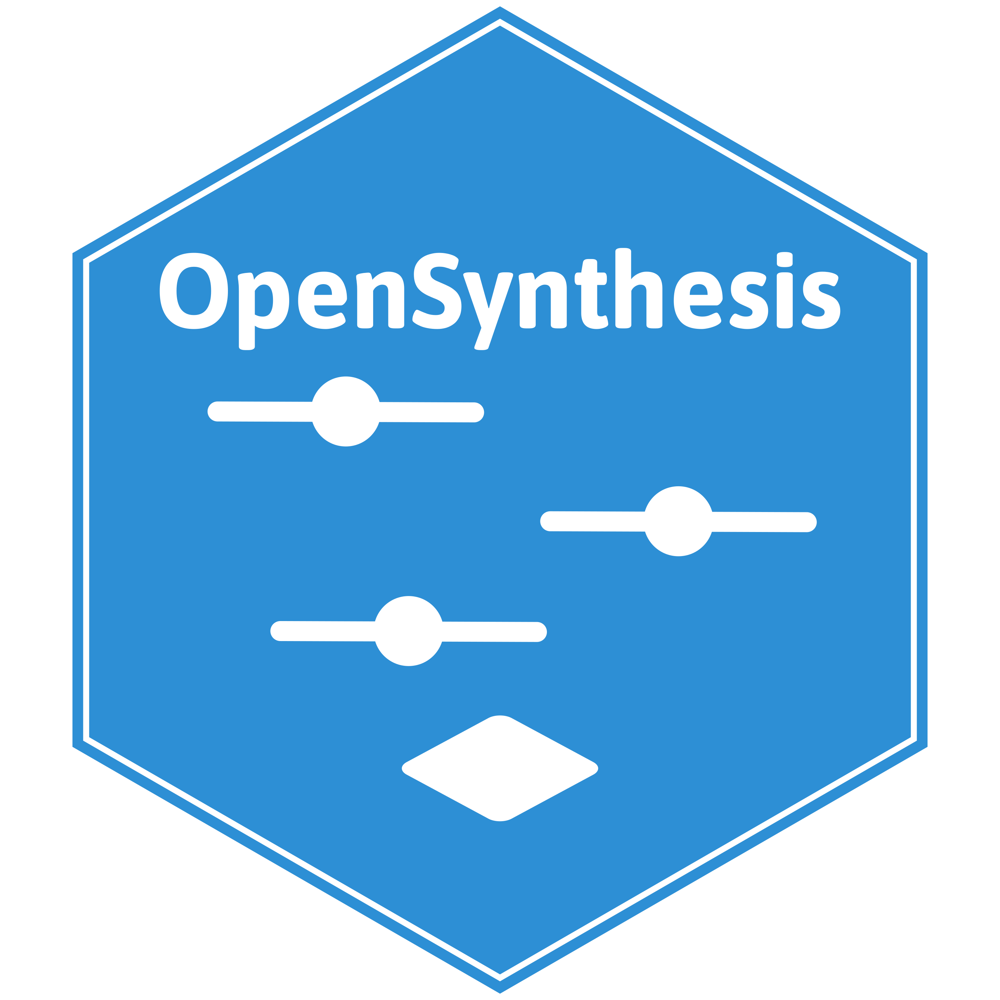

::: {.mbj-cards}

::: {.mbj-card}
::: {.mbj-card-logo}
{fig-alt="ThemePark logo"}
:::
::: {.mbj-card-body}
[R package]{.mbj-card-kind}

### ThemePark

Popular-culture styled ggplot themes. Featured on [rweekly.org](https://rweekly.org/2023-W32.html) and [flowingdata.com](https://flowingdata.com/2023/07/28/barbie-and-oppenheimer-themes-for-charts-in-r/).

::: {.mbj-card-links}
[ GitHub](https://github.com/MatthewBJane/theme_park){.btn .btn-secondary}
:::
:::
:::

::: {.mbj-card}
::: {.mbj-card-logo}
{fig-alt="POSC logo"}
:::
::: {.mbj-card-body}
[R package]{.mbj-card-kind}

### POSC

Probability of Outcome Superiority Curves (POSCs) in R.

::: {.mbj-card-links}
[ GitHub](https://github.com/MatthewBJane/posc){.btn .btn-secondary} [ Simulator](posc-simulator.qmd){.btn .btn-secondary}
:::
:::
:::

::: {.mbj-card}
::: {.mbj-card-logo}
{fig-alt="OpenSynthesis logo"}
:::
::: {.mbj-card-body}
[Database]{.mbj-card-kind}

### OpenSynthesis

A catalog of publicly available meta-analytic databases.

::: {.mbj-card-links}
[ GitHub](https://github.com/MatthewBJane/opensynthesis){.btn .btn-secondary} [ Website](https://matthewbjane.com/opensynthesis/){.btn .btn-secondary}
:::
:::
:::

:::
