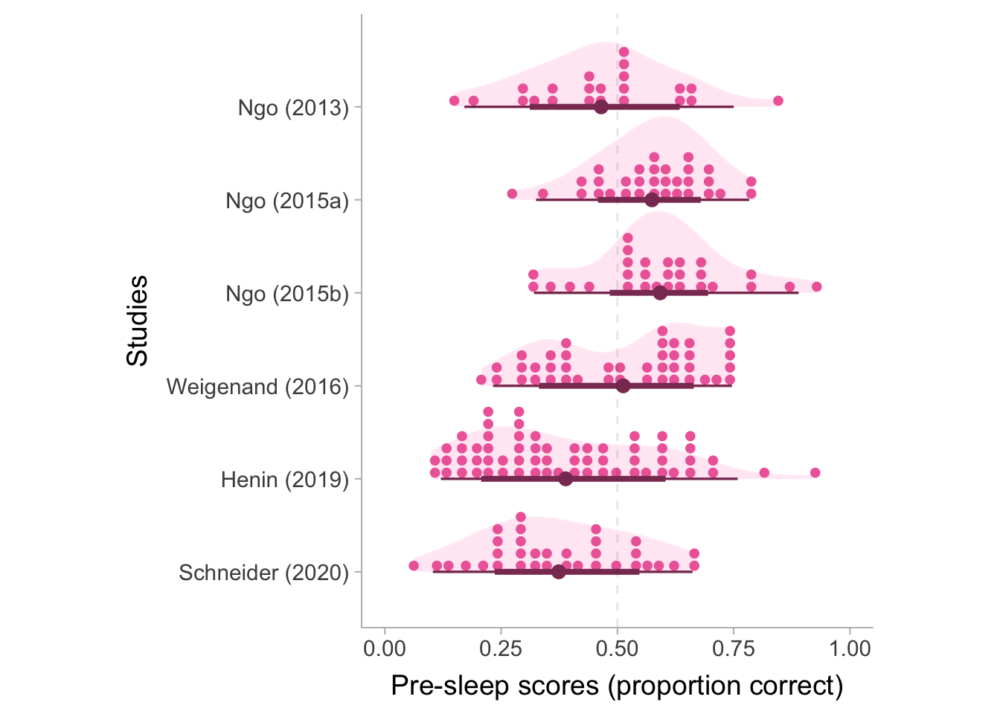
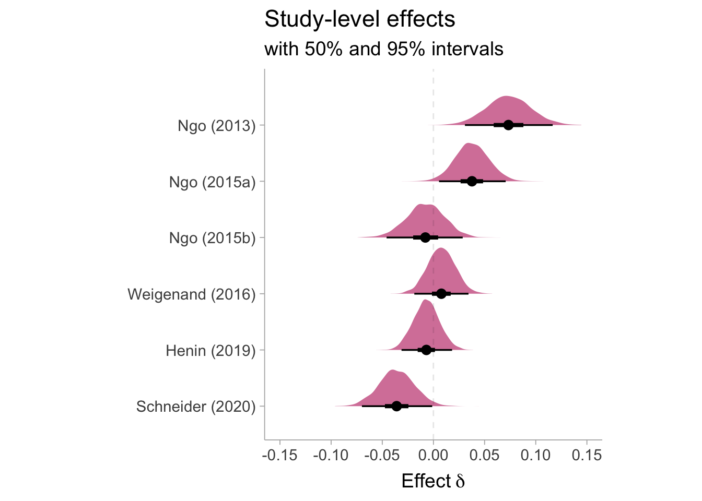
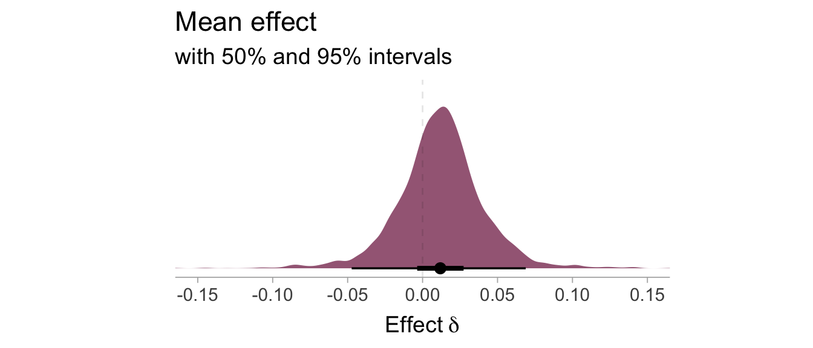
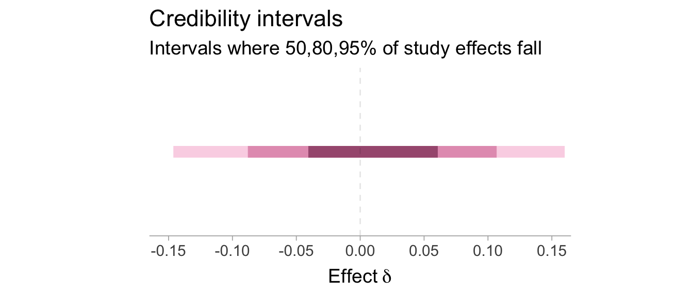
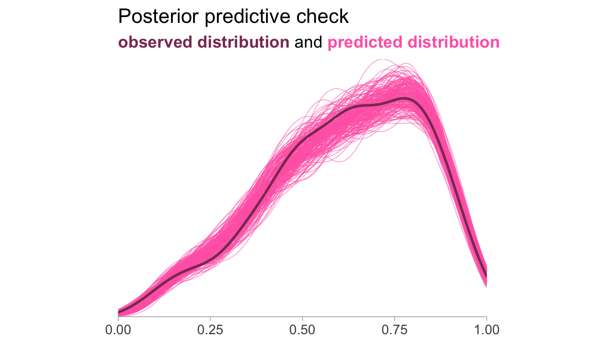

::: {.callout-note appearance="simple"}
This post is archived and is no longer updated. [See all archived posts](../blog.qmd).
:::

```{=html}
<a href="https://www.buymeacoffee.com/matthewbjane"></a>
```
<br>

## Description of the Meta-analysis

#### Study design

The studies in this meta-analysis are investigating if auditory stimuli during slow-wave sleep can enhance overnight memory retention (this is based on theoretical reasons we don't need to get into). In each study the participants undergo two sleep sessions reflecting two conditions. In one of the sessions, auditory stimuli (i.e., pink noise bursts) were presented while the subject's were in deep slow-wave sleep ("stim" condition). In the other session there was no auditory stimuli ("sham" condition). These sleep sessions were separated by a week (or two) and were counter-balanced such that the ordering of conditions were randomized. Before subject's go to sleep, subjects were given word-pairs that they are required to memorize. Prior to falling asleep they are assessed on how many word-pairs they can accurately remember (they are given one word and they are told to recall the other word). After the subjects wake up, they are assessed on the same task and the number of word-pairs they can remember correctly. So ultimately we have a repeated-measures (pre-post) cross-over (treatment-control) design.

We can load in the necessary packages [@tidyverse, @readr, @brms, @tidybayes] and get the data from my [github repository](https://github.com/MatthewBJane/meta-analysis-data-code/blob/main/acoustic_stimulation_and_memory/data/individual_person_data.csv).

```r
library(tidyverse)
library(readr)
library(brms)
library(tidybayes)
library(modelr)
library(ggdist)
library(ggtext)

urlfile="https://raw.githubusercontent.com/MatthewBJane/meta-analysis-data-code/refs/heads/main/acoustic_stimulation_and_memory/data/individual_person_data.csv"

df <- read_csv(url(urlfile))

head(df)
```

``` {.cell-output}
# A tibble: 6 × 6
  study preSham postSham preStim postStim total_words
  <chr>   <dbl>    <dbl>   <dbl>    <dbl>       <dbl>
1 W2016      89      103      69       93         120
2 W2016      59       89      72       92         120
3 W2016      80       95      48       77         120
4 W2016      47       75      57       75         120
5 W2016      40       67      61       91         120
6 W2016      78      104      71       99         120
```

We can see that each subject has four values: pre-stim, post-stim, pre-sham, and post-sham. The values denote the number of words recalled correctly and the total words column is the total number of word-pairs the subject was tasked to memorize. In total, there are 7 studies and 110 subjects.

#### Outcome of interest

Across studies the total number of word-pairs in the recall task varied (range: 80-120) and, consequently, so does the number of word-pairs correctly recalled. This produced different number of correctly recalled words. For this reason, we will choose to use probability of recalling a word-pair accurately.

Assume $Y_{ij} \in \{0,1\}$ is a Bernoulli random variable that denotes whether a word-pair has been correctly recalled (1) or not (0) for assessment $i$ and trial $j$. Let each session $i$ have it's own probability distribution for $Y$ such that $Y_{ij} \sim \mathrm{Ber}(\pi_i)$ where the parameter $\pi_i$ is the *true* probability of correctly recalling a word-pair for session $i$ such that, $\pi_i = \Pr_i(Y_{ij}=1)$. Our data set will contain observed proportions $p_i = \frac{N_{\text{correct},i}}{N_{\text{total word-pairs},i}}$ which are estimates of $\pi_i$. Therefore the outcome of interest is a probability-valued random variable $\pi_i$ which is measured by the observed proportion $p_i$.

#### Time and condition variables

We have two other Bernoulli random variables that represents time $T_i$ (pre=0, post=1) and condition $C_i$ (sham=0, stim=1). Of course, condition and time do not vary by trial so the subscript $j$ is removed. We can condition the probability of correctly recalling a word ($\pi_i$) on values of $T_i$ and $C_i$ so that we have four possible experimental states,

-   Pre-sleep, sham condition: $\;\pi^{(0)}_{\mathrm{pre},i} := \Pr_i(Y_{ij}\! =\!1 \mid T_i\! =\!0, C_i\! =\!0)$
-   Post-sleep, sham condition: $\pi^{(0)}_{\mathrm{post},i} := \Pr_i(Y_{ij}\! =\!1 \mid T_i\! =\!1, C_i\! =\!0)$
-   Pre-sleep, stim condition: $\;\;\;\pi^{(1)}_{\mathrm{pre},i} := \Pr_i(Y_{ij}\! =\!1 \mid T_i\! =\!0, C_i\! =\!1)$
-   Post-sleep, stim condition: $\;\;\pi^{(1)}_{\mathrm{post},i} := \Pr_i(Y_{ij}\! =\!1 \mid T_i\! =\!1, C_i\! =\!1)$

Every participant has an observed proportion for all four experimental states: $p^{(0)}_{\mathrm{pre},i}$, $p^{(0)}_{\mathrm{post},i}$, $p^{(1)}_{\mathrm{pre},i}$, and $p^{(1)}_{\mathrm{post},i}$. What we want to do is make the data set long where condition is a dummy variable, this will set up our data such that we can fit an ANCOVA model in the next section.

```r
dat <- df %>%
  # relabel the column headers
  rename(pre.sham = preSham, pre.stim = preStim, 
         post.sham = postSham, post.stim = postStim) %>%
  # add row for person id
  mutate(person = 1:nrow(df), .after = study) %>%
  # make data set long so that there is one column of scores
  pivot_longer(cols = c(pre.sham, post.sham, pre.stim, post.stim),
               names_to = "session",
               values_to = "num_correct") %>%
  # separate the session column into random variables time T and condition C
  separate(col = session, into = c("time", "condition")) %>%
  # recode variables as factors with levels 0 and 1
  pivot_wider(names_from = time,
              values_from = c(num_correct,total_words),
              id_cols = c(person,condition,study)) %>%
  # clean up variable values and calculate proportions 
  mutate(condition = factor(condition, levels = c("sham","stim"), labels = c(0,1)),
         study = factor(study, 
                        levels = rev(c("N2013","N2015.1","N2015.2","W2016","H2019.1","H2019.2","S2020")),
                        labels = rev(c("Ngo (2013)","Ngo (2015a)","Ngo (2015b)","Weigenand (2016)","Henin (2019)","Henin (2019)","Schneider (2020)"))),
         p_pre = num_correct_pre / (total_words_pre+(.005*total_words_pre)),
         p_post = num_correct_post / (total_words_post+(.005*total_words_post))) %>%
  # clean up columns
  select(study, person, condition, p_pre, p_post)

# display cleaned data set
head(dat,8)
```

``` {.cell-output}
# A tibble: 8 × 5
  study            person condition p_pre p_post
  <fct>             <int> <fct>     <dbl>  <dbl>
1 Weigenand (2016)      1 0         0.738  0.854
2 Weigenand (2016)      1 1         0.572  0.771
3 Weigenand (2016)      2 0         0.489  0.738
4 Weigenand (2016)      2 1         0.597  0.763
5 Weigenand (2016)      3 0         0.663  0.788
6 Weigenand (2016)      3 1         0.398  0.638
7 Weigenand (2016)      4 0         0.390  0.622
8 Weigenand (2016)      4 1         0.473  0.622
```

Now we have columns for the proportions at pre-test and post-test for each condition. Notice that each person has two rows pertaining to the stim and sham condition.

#### Effect Size of Interest

We would like to the estimate the effect of auditory stimulation on memory retention, so therefore we would like to compare the post-sleep recall proportion correct between conditions. Our effect size of interest can be the defined as the average difference between post-sleep recall scores in the treatment and control group conditioned on a pre-sleep score of .50,

$$
\delta = \mathbb{E}\left(p^{(1)}_{\mathrm{post},i}\,- p^{(0)}_{\mathrm{post},i}\, \middle|\, p_{\mathrm{pre},i} = .50\right).
$$

Since this effect size is essentially an average of risk differences, conditioning on a pre-sleep value of .50 is useful as is put succinctly by [Karlson and Quillian (2023)](https://journals.sagepub.com/doi/10.1177/23780231231192394#:~:text=Risk%20differences%20are%20useful%20when,often%20be%20a%20good%20choice.) **"Risk differences are useful when base rates are in a middle range"**. We will see that the IPD model will use the pre-sleep score as a covariate so conditioning on pre-sleep scores is straightforward. The grand average pre-sleep score is \~.47, which makes conditioning on .50 a bit easier to justify. We can visualize the pre-sleep scores for each study below, we can see that they are fairly evenly distributed around .50.

<details class="code-fold">
<summary>Code</summary>

```r
ggplot(dat, aes(x = p_pre, y = study)) +
  stat_slab(point_interval = "mean_qi",fill = "hotpink",slab_color = "transparent", slab_alpha = .15) +
  stat_dotsinterval(point_interval = "mean_qi",fill = "hotpink2",slab_color = "transparent", color = "hotpink4") +
  lims(x = c(0,1)) +
  theme_ggdist(base_size = 14) +
  theme(aspect.ratio = 1.2) +
  geom_vline(xintercept = c(.5), linetype = "dashed", alpha = .1, color = "black") +
  labs(x = "Pre-sleep scores (proportion correct)",
       y = "Studies") 
```

</details>



We can interpret the effect size as: on average, a typical person sees a $[\delta\times 100]$ percentage point increase in accurately recalling a word-pair in the stim condition relative to the sham condition. An effect size value of $\delta < 0$ would indicate reduced recall in the stim group (i.e., stim was actually detrimental relative to sham), a value between $\delta >0$ would indicate increased recall in the stim group (i.e., stim was beneficial relative to sham), and a value of $\delta=1$ would be a null effect. Important to note that $\delta$ is not standardized in this meta-analysis because scores are comparable across studies.

## IPD Model (pre-sleep score as covariate)

With our data we can model the observed proportions as a beta distribution such that $p_{\mathrm{post},i} \sim \mathrm{Beta}(\mu_i,\phi)$ where $\mu_i$ is the conditional mean (i.e., $\mu_i:=\mathbb{E}(p_{\mathrm{post},i}\, |\, p_{\mathrm{pre},i}, C_i )$) and $\phi$ is the concentration ($\phi$ is inversely related to the variance and we can obtain the variance of $p_i$ with $\mu(1-\mu)/(\phi+1)$). We can model the logit transformed $\mu_i$ with an ANCOVA type model by using the pre-sleep scores as a predictor within a regression model.

$$
\mathrm{logit}(\mu_{i})  = \beta_{0,sp} +  \beta_{1,s}\,p_{\mathrm{pre},i} + \beta_{2,s}\, C_i
$$

$C_i\in\{0,1\}$ and represent the condition (0=sham, 1=stim). This means that the model-implied conditional mean is,

$$
\mu_i = \frac{\exp(\beta_{0,sp} +  \beta_{1,s}\,p_{\mathrm{pre},i} + \beta_{2,s}\, C_i)}{1 + \exp(\beta_{0,sp} +  \beta_{1,s}\,p_{\mathrm{pre},i} + \beta_{2,s}\, C_i)}
$$

To obtain person and study-level variability, we want to incorporate a random effect for study samples on each of the regression coefficients (there are 7 studies, denoted with subscript $s = 1...7$). We also allow the intercept to vary between individuals such that each person $p$ has a random intercept (this is reasonable since there are individual differences in recall ability). Note that having condition vary by person (each person has 2 data points pertaining to treatment-control) would produce a model that is not identifiable. We will just use the default `brms` priors for all parameters.

```r
mdl <- bf(p_post ~ 0 + Intercept + p_pre + condition + (1|person) + (1+p_pre+condition|study), 
          family = Beta("logit"))

prior <- default_prior(mdl, data = dat)

fit <- brm(mdl,
           data = dat,
           cores = 2, 
           iter = 2000,
           warmup = 200,
           chains = 3,
           prior = prior,
           file = "ipd_meta",
           file_refit = "on_change")
```

I recommend reading A. Solomon Kurz's awesome [blog post on Beta regression for causal inference](https://solomonkurz.netlify.app/blog/2023-06-25-causal-inference-with-beta-regression/#beta-likelihood), which inspired some of this model (if I made any mistakes that does not reflect on Solomon's blog, that is just me being dense).  

#### Study-level estimates of $\delta$

Let's observe the posterior distribution of effects from each study in the meta-analysis. Visualizations created with the help of the awesome `tidybayes` and `ggdist` packages [@tidybayes, @ggdist].

```r
nd <- data_grid(condition = 0:1,
                p_pre = .5,
                person = NA,
                study = dat$study,
                data = dat)

add_epred_draws(fit, newdata = nd, allow_new_levels = TRUE, re_formula = ~ (1+p_pre+condition|study)) %>%
  pivot_wider(names_from = condition,
              values_from = .epred,
              id_cols = c(study,.draw)) %>%
  mutate(delta = `1` - `0`) %>%
  ggplot(aes(x = delta, y = study)) +
  stat_slabinterval(point_interval = "mean_qi",fill = "hotpink3", slab_alpha = .80, .width = c(.50,.95)) +
  theme_ggdist(base_size = 14) +
  theme(aspect.ratio = 1.1) +
  coord_cartesian(xlim = c(-.15,.15)) +
  geom_vline(xintercept = 0, linetype = "dashed", alpha = .1, color = "black") +
  scale_x_continuous(breaks = round(seq(-.15,.15,by=.05),2)) +
  labs(x = expression(Effect ~ delta),
       y = "") +
  ggtitle("Study-level effects", subtitle = "with 50% and 95% intervals")
```



In our original paper we found a strong moderating effect of publication year on the effect size. Although we were only able to get a subset of the raw data sets, you can still see the shadow of that trend appears here.

#### Mean Effect

Now we want to estimate the average effect across studies, the key here is to set the `re_formula` argument in the add_epred_draws to `NA`. The figure below denotes the distribution of plausible values for the average true effect.

```r
nd <- data_grid(condition = 0:1,
                p_pre = .5,
                person = NA,
                study = NA,
                data = dat)

posterior_mean <- add_epred_draws(fit, newdata = nd, re_formula = NA) %>%
  pivot_wider(names_from = condition,
              values_from = .epred,
              id_cols = .draw) %>%
  mutate(delta = `1` - `0`)

ggplot(data = posterior_mean, aes(x = delta, y = 0)) +
  stat_slabinterval(point_interval = "mean_qi",fill = "hotpink4", slab_alpha = .80, .width = c(.50,.95)) +
  theme_ggdist(base_size = 14) +
  theme(aspect.ratio = .4) +
  coord_cartesian(xlim = c(-.15,.15)) +
  geom_vline(xintercept = 0, linetype = "dashed", alpha = .1, color = "black") +
  labs(x = expression(Effect ~ delta),
       y = "") +
  ggtitle("Mean effect", subtitle = "with 50% and 95% intervals") +
  scale_x_continuous(breaks = round(seq(-.15,.15,by=.05),2)) +
  scale_y_continuous(breaks = NULL)
```



As we can see there is little/no *average* effect of the stim condition 0.012 [-0.047, 0.069]. The estimate suggests there is about a 1% in recall probability difference from stim to sham. 

Let's now obtain the credibility intervals which tells us what in what range of $\delta$ do *X%* of study effects fall. The figure below will show 50, 80, and 95% credibility intervals. To do this in `brms` I am like 99% sure we just need to incorporate all the study-level random effects in the `re_formula` argument again. Therefore we would want to specify it as `re_formula = ~(1+p_pre+condition|study)`.

```r
nd <- data_grid(condition = 0:1,
                p_pre = .5,
                person = NA,
                study = "new_study",
                data = dat)

add_predicted_draws(fit, newdata = nd, allow_new_levels = TRUE, re_formula = ~(1+p_pre+condition|study)) %>%
  pivot_wider(names_from = condition,
              values_from = .prediction,
              id_cols = .draw) %>%
  mutate(delta = `1` - `0`) %>%
  ggplot(aes(x = delta, y = 0)) +
  stat_interval(point_interval = "mean_qi",color = c("hotpink4","hotpink3","hotpink2"), alpha = c(.7,.5,.3), .width = c(.5,.80,.95)) +
  coord_cartesian(xlim = c(-.15,.15)) +
  scale_x_continuous(breaks = round(seq(-.15,.15,by=.05),2)) +
  theme_ggdist(base_size = 14) +
  theme(aspect.ratio = .4) +
  geom_vline(xintercept = 0, linetype = "dashed", alpha = .1, color = "black") +
  labs(x = expression(Effect ~ delta),
       y = "") +
  ggtitle("Credibility intervals", subtitle = "Intervals where 50,80,95% of study effects fall") +
  scale_y_continuous(breaks = NULL)
```



#### Diagnostics

Let's observe the posterior predictive check to see if our model performed as we expected.

```r
pp_check(fit, ndraws = 200) + 
  xlim(0,1) +
  theme_ggdist(base_size = 14) +
  scale_y_continuous(breaks=NULL) +
  scale_color_manual(values = c("hotpink4", "hotpink")) +
  ggtitle("Posterior predictive check", 
          subtitle = "<span style = 'color:hotpink4'>**observed distribution**</span> and <span style = 'color:hotpink'>**predicted distribution**</span>") +
  theme(legend.position = "none",
        title = element_markdown(),
        axis.text = element_text(family = "arial"), 
        aspect.ratio = .7)
```



The predictive check looks quite good! 

Anyways... thats the post. Let me know if you have any suggestions or critiques.

## Session Info

```r
sessionInfo()
```

``` {.cell-output}
R version 4.4.2 (2024-10-31)
Platform: aarch64-apple-darwin20
Running under: macOS Sequoia 15.4.1

Matrix products: default
BLAS:   /Library/Frameworks/R.framework/Versions/4.4-arm64/Resources/lib/libRblas.0.dylib 
LAPACK: /Library/Frameworks/R.framework/Versions/4.4-arm64/Resources/lib/libRlapack.dylib;  LAPACK version 3.12.0

locale:
[1] en_US.UTF-8/en_US.UTF-8/en_US.UTF-8/C/en_US.UTF-8/en_US.UTF-8

time zone: America/New_York
tzcode source: internal

attached base packages:
[1] stats     graphics  grDevices datasets  utils     methods   base     

other attached packages:
 [1] ggtext_0.1.2    ggdist_3.3.2    modelr_0.1.11   tidybayes_3.0.7
 [5] brms_2.22.0     Rcpp_1.0.12     lubridate_1.9.3 forcats_1.0.0  
 [9] stringr_1.5.1   dplyr_1.1.4     purrr_1.0.2     readr_2.1.5    
[13] tidyr_1.3.1     tibble_3.2.1    ggplot2_3.5.1   tidyverse_2.0.0

loaded via a namespace (and not attached):
 [1] svUnit_1.0.6         tidyselect_1.2.1     viridisLite_0.4.2   
 [4] farver_2.1.2         loo_2.8.0            fastmap_1.2.0       
 [7] tensorA_0.36.2.1     digest_0.6.36        timechange_0.3.0    
[10] lifecycle_1.0.4      StanHeaders_2.32.10  magrittr_2.0.3      
[13] posterior_1.6.0      compiler_4.4.2       rlang_1.1.4         
[16] tools_4.4.2          utf8_1.2.4           yaml_2.3.8          
[19] knitr_1.47           labeling_0.4.3       bridgesampling_1.1-2
[22] htmlwidgets_1.6.4    bit_4.0.5            pkgbuild_1.4.4      
[25] plyr_1.8.9           xml2_1.3.6           abind_1.4-8         
[28] withr_3.0.0          grid_4.4.2           stats4_4.4.2        
[31] fansi_1.0.6          colorspace_2.1-0     inline_0.3.19       
[34] scales_1.3.0         cli_3.6.3            mvtnorm_1.3-1       
[37] rmarkdown_2.27       crayon_1.5.3         generics_0.1.3      
[40] RcppParallel_5.1.9   rstudioapi_0.16.0    reshape2_1.4.4      
[43] tzdb_0.4.0           commonmark_1.9.2     rstan_2.32.6        
[46] bayesplot_1.11.1     parallel_4.4.2       matrixStats_1.4.1   
[49] vctrs_0.6.5          Matrix_1.7-1         jsonlite_1.8.8      
[52] hms_1.1.3            arrayhelpers_1.1-0   bit64_4.0.5         
[55] glue_1.7.0           codetools_0.2-20     distributional_0.4.0
[58] stringi_1.8.4        gtable_0.3.5         QuickJSR_1.3.1      
[61] quadprog_1.5-8       munsell_0.5.1        pillar_1.9.0        
[64] htmltools_0.5.8.1    Brobdingnag_1.2-9    R6_2.5.1            
[67] vroom_1.6.5          evaluate_0.24.0      lattice_0.22-6      
[70] markdown_1.13        backports_1.5.0      gridtext_0.1.5      
[73] broom_1.0.6          renv_0.17.3          rstantools_2.4.0    
[76] gridExtra_2.3        coda_0.19-4.1        nlme_3.1-166        
[79] checkmate_2.3.1      xfun_0.45            pkgconfig_2.0.3     
```

## Citing R packages

The following packages were used in this post:

-   `brms` [@brms]
-   `tidyverse` [@tidyverse]
-   `ggdist` [@ggdist]
-   `modelr` [@modelr]
-   `tidybayes` [@tidybayes]

<iframe src="https://embeds.beehiiv.com/f3ffd81a-4723-4419-bb1d-afc8af3bac36" data-test-id="beehiiv-embed" width="100%" height="320" frameborder="0" scrolling="no" style="border-radius: 4px; border: 2px solid #33333322; margin: 0; background-color: transparent;">

</iframe>
