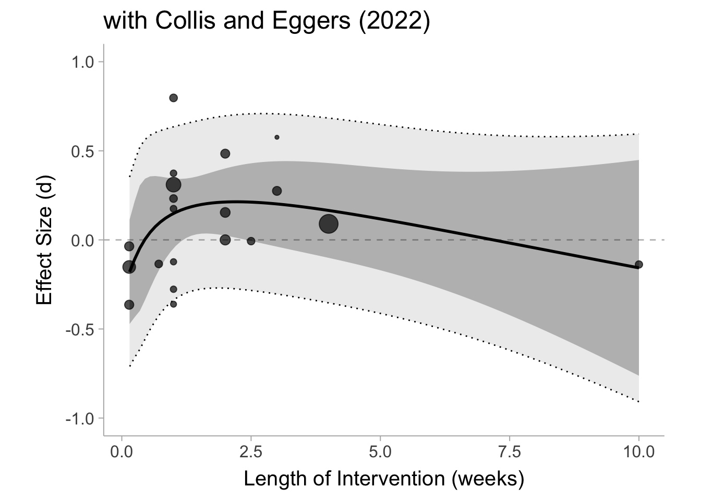
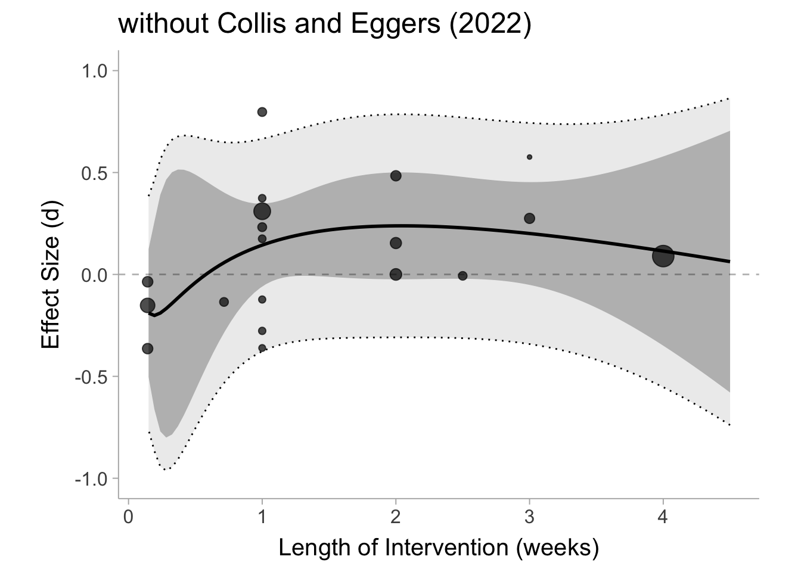
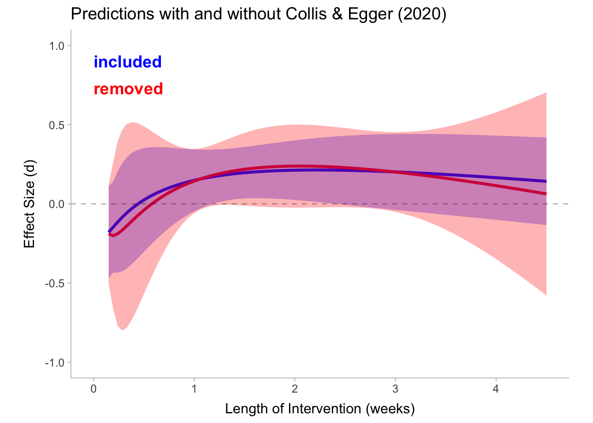

::: {.callout-note appearance="simple"}
This post is archived and is no longer updated. [See all archived posts](../blog.qmd).
:::

```{=html}
<a href="https://www.buymeacoffee.com/matthewbjane"></a>
```
<br>

## Establishing my motivation

Although my original post made it seem that I have some prior opinion that social media effects mental health. In reality, I actually think that social media probably ***does*** have an average negative effect on mental health. I also probably agree that the RCTs in this meta-analysis probably won't find any convincing causal estimates. If Rausch and Haidt's (R&H) made the argument that there is a causal effect, but the RCTs won't capture then I would have never made my original post. What I know is meta-analysis, not the literature on social media use and mental health. I was motivated to write the original post because of the clear statistical malpractice employed in R&H's re-analysis. I have no desire to prove or disprove whether social media is actually detrimental to mental health, but I do have a desire to combat the spread of misleading analyses and poor statistical practice.

Also, to those absurd comments and emails out there saying that I am somehow working for big Pharma, social media companies, the government, or profiting on some misinformation campaign: I am literally a graduate student who lives with my parents to save money on rent (you can help me out by buying me a [coffee](https://www.buymeacoffee.com/matthewbjane)). I do this because I truly believe in the fight for a rigorous, open, and transparent science. I have been very critical of how academia operates and I hope to make some positive change to that end. Anyways, on to the post...

## Where could I have been better?

The best criticisms of my blog outside of R&H's criticisms seemed to have been that length weeks should have been log scaled (pulling in that 10 week intervention) and also I should have fit some non-linear model. I think these are completely valid points and I will conduct that analysis in this blog post.

R&H responded to one of my last analyses in the post (regressing the effect size on length of intervention) and said the following:

> a blog post by Matthew Jané used Ferguson’s numbers and concluded that there is no relationship between the duration of reduction and the effect size.

This is all true (with the slight quibble that I said "little/no" relationship) and I should have been clearer about the assumptions underlying my claim. In my original post I said this:

> Okay so as it turns out there appears to be little/no effect of the length of the intervention on the effect size.

I really should have said this:

> [***Given the proposed model and the data,***]{style="color:red;"} there appears to be little/no effect of the length of the intervention on the effect size.

Usually that does not need to be said considering the model was defined, but it is important nonetheless, since if I were to choose a different model it is possible we could have see a relationship between the two variables.

## In Response to the Community Note on Haidt's Tweet

A community note (that I did not write) was attached to Haidt's tweet containing the R&H re-analysis. It has since disappeared, but here was the content of the note:

> As many statistics experts have pointed out, this analysis is incorrect. If done correctly, the analysis shows that reducing social media has no effect. *\*then it links to my blog post as a source\**

Although the first sentence I believe is accurate, the **second sentence is not true and I did not state that in the original post**. Therefore I am okay that the community note was taken down for whatever reason. Then promptly, a better and even more recent community note was posted that read,

> The reanalysis doesn't use an appropriate statistical model. It simply calculates an unweighted average across different studies, doesn't provide confidence intervals, and misinterprets the evidence

All these points are unequivocally true. However, Haidt then posted the following tweet,

```{=html}
<blockquote class="twitter-tweet" data-align="center"><a href="https://twitter.com/jonhaidt/status/1830583665891385415">View this post by @jonhaidt on X</a></blockquote>
<script async src="https://platform.twitter.com/widgets.js" charset="utf-8"></script>
```

This tweet seemed to get his followers to rate the community note as unhelpful and thus it was taken down again. Of course, it is difficult to maintain a community note with Haidt's large following. So I guess we will have to treat these blog posts as a much more detailed community note.

## R&H's analysis was unequivocally a meta-analysis

In a tweet by Haidt, he pointed out that R&H's re-analysis should not be considered a meta-analysis:

> I think it was a mistake to treat our essay as a meta-analysis

The reason I treated R&H's re-analysis as a meta-analysis is because it is, by definition, a meta-analysis. Let me be clear, R&H's analysis consisted of **1) averaging results across studies** and **2) counting up positive, negative, and null effects**, both of which are just different obsolete and unacceptable methods of meta-analysis (the latter is commonly referred to as a vote-counting meta-analysis). If you are unconvinced, here is the definition of a meta-analysis from the [Cochrane handbook](https://training.cochrane.org/handbook/current/chapter-10):

> Meta-analysis is the statistical combination of results from two or more separate studies.

If you simply calculate an average effect size across studies, you have conducted a meta-analysis. If you tally up the number of positive and negative results, you have conducted a meta-analysis. Every table in R&H's article is literally displaying a meta-analysis, whether that was their intent or not.

On top of all of the fundamental flaws in their analysis, R&H also based the following claim on their meta-analytic results:

> These results clearly indicate that multi-week social media reduction experiments improve some aspects of well-being

Their results absolutely do not *clearly* indicate this. This is an extremely misleading conclusion that is based on a completely inappropriate analysis.

**I recommend that R&H remove the tables with meta-analytic results and all the conclusions/claims associated with those results. Adding a postscript, a preface, and changing the title does not fix this.**

## Errors in Effect Sizes and Sample Sizes

Haidt also claims that there are errors in the effect sizes and sample sizes in @ferguson2024's meta-analysis:

> Our post was about how there are so many errors in the Ferguson meta, including errors in sample sizes and effect sizes, that we can't yet do weighting or confidence intervals.

Yet R&H still conduct their re-analysis on those effect sizes. **If the data is untrustworthy why conduct any analysis in the first place?** Why is it more justifiable to compute unweighted average effects without any indicator of variability from that data base? If they believe that the data is untrustworthy, why conduct the analysis at all? If we decide to conduct an analysis, we must do it using the appropriate statistical techniques. **Like I said previously, if R&H retracted their re-analysis and instead argued that these RCTs do not properly capture the causal effects of social media on mental health, I would probably agree with them.**

I do not have the time to double check all the effect sizes of Ferguson's meta-analysis. I analyzed them at face value which is exactly what R&H did in their re-analyses.

## Haidt's future meta-analysis

Haidt has proposed that he is planning to conduct a re-do of the @ferguson2024's meta-analysis

> Nonetheless, all of this is to show why we are not trying to do our own meta analysis with Ferguson’s data. In a future post we plan to do a review of the evidence from scratch so that we avoid these many problems. (It’s worth noting that we have also found five additional multi-week reduction studies, all of which find benefits to reduction, which are not in Ferguson’s meta).

***To Jonathan Haidt***: **I would love to offer my help as a collaborator/consultant for this upcoming project so that we can establish a systematic, transparent, reproducible, and rigorous review, and meta-analysis plan. I also know many awesome and knowledgeable meta-analysts that I would be happy to recommend to you. You can email me at matthew.jane\@uconn.edu**

Constructing a systematic, rigorous, transparent, and fully reproducible meta-analysis is not only difficult, it is also exceedingly rare.

## Controversy surrounding the study by Collis and Egger (2022)

R&H's primary critique of my analysis was that Collis and Egger's (2022) study shouldn't be included because the manipulation check failed. From my reading of the paper, the treatment group did demonstrate lower screen time for facebook, instagram, and snapchat, however *higher* for instant messaging apps, news/media, gaming, as well as overall screen time. R&H mention WhatsApp as one of the primary apps that people replaced social media with. It does not seem that people really consider instant messaging like WhatsApp a form of social media (see poll results below):

```{=html}
<blockquote class="twitter-tweet" data-align="center"><a href="https://twitter.com/matthewbjane/status/1830399884299481182">View this post by @matthewbjane on X</a></blockquote>
<script async src="https://platform.twitter.com/widgets.js" charset="utf-8"></script>
```

It does not seem clear to me that this is a failed manipulation check, especially considering total digital screen time is not the target intervention variable. R&H also mention there is no evidence that other social media apps were used:

> In addition, there is no evidence that participants reduced their use of other social media platforms such as TikTok, YouTube, Twitter, and Reddit (all of which were widely used by college students in 2019).

However that is true for a lot of the other studies in this meta-analysis where screen time wasn't even monitored or monitored with self-report rather than more objective measures. I do not think we should punish one study for being transparent and providing a manipulation check.

Although I am against the exclusion of Collis and Eggers (2022) in principle, I will nevertheless fit the regression model with and without it.

## Setting up the code

In this section we are just going to run the code we went over in the last blog post (see [here](https://matthewbjane.com/blog-posts/blog-post-6.html))

```r
# load in packages
library(mgcv)
library(splines)
library(osfr)
library(tidyverse)
library(metafor)
library(readxl)
library(psychmeta)

# download data from OSF repo
read_xlsx("~/Documents/MatthewBJane.nosync/blog-posts/Best Practices Coding Experiments.xlsx")
```

``` {.cell-output}
# A tibble: 35 × 16
   Citation       block     n      d Standardized Outcome…¹ `Validated Outcomes`
   <chr>          <lgl> <dbl>  <dbl>                  <dbl>                <dbl>
 1 Alcott 2020    NA     1661  0.09                       1                    1
 2 Brailovskaia … NA      286  0.154                      1                    1
 3 Brailovskaia … NA      322  0                          1                    1
 4 Collins and E… NA      121 -0.138                      1                    1
 5 Deters & Mehl… NA       86 -0.207                      1                    1
 6 Faulhaber et … NA      230  0.484                      1                    1
 7 Gajdics 2022   NA      235 -0.364                      1                    1
 8 Hall et al. 2… NA      130 -0.007                      1                    1
 9 Hunt 2018      NA      143  0.232                      1                    1
10 Hunt 2021      NA       88  0.374                      1                    1
# ℹ 25 more rows
# ℹ abbreviated name: ¹​`Standardized Outcomes`
# ℹ 10 more variables: `Matched Control Condition` <dbl>,
#   `Distractor Questionnaires` <dbl>, `Query hypothesis guessing` <dbl>,
#   Preregistration <dbl>, Age <dbl>, Year <dbl>, `Best Practices Total` <dbl>,
#   `Verified 1= yes, 2=no` <dbl>, `Ratio at post` <dbl>,
#   `Citation Bias 1=yes, 2 = no` <dbl>
```

```r
# load in dataset and filter out studies without data
dat <- read_excel("Best Practices Coding Experiments.xlsx",
                  sheet = 1) %>%
  filter(!is.na(d))

# display effect size data for first 6 studies
head(dat[c("Citation","n","d")])
```

``` {.cell-output}
# A tibble: 6 × 3
  Citation                    n      d
  <chr>                   <dbl>  <dbl>
1 Alcott 2020              1661  0.09 
2 Brailovskaia 2020         286  0.154
3 Brailovskaia 2022         322  0    
4 Collins and Edgers 2022   121 -0.138
5 Deters & Mehl 2013         86 -0.207
6 Faulhaber et al., 2023    230  0.484
```

```r
# compute sampling variance
dat <- dat %>% 
  mutate(v = var_error_d(d = d, n1 = n))

# display updated dataset
head(dat[c("Citation","n","d","v")])
```

``` {.cell-output}
# A tibble: 6 × 4
  Citation                    n      d       v
  <chr>                   <dbl>  <dbl>   <dbl>
1 Alcott 2020              1661  0.09  0.00241
2 Brailovskaia 2020         286  0.154 0.0141 
3 Brailovskaia 2022         322  0     0.0125 
4 Collins and Edgers 2022   121 -0.138 0.0337 
5 Deters & Mehl 2013         86 -0.207 0.0479 
6 Faulhaber et al., 2023    230  0.484 0.0181 
```

```r
dat <- dat %>%
  mutate(length_weeks = c(4, # Alcott 2020
                          2, # Brailovskaia 2020
                          2, # Brailovskaia 2022
                          10, # Collins and Edgers 2022
                          NA, # Deters & Mehl 2013
                          2, # Faulhaber et al., 2023
                          1/7, # Gajdics 2022
                          2.5, # Hall et al. 2021
                          1, # Hunt 2018
                          1, # Hunt 2021
                          1, # Kleefeld dissertation
                          1, # Lambert 2022
                          NA, # Lepp 2022
                          1, # Mahalingham 2023
                          1/7, # Mitev 2021
                          NA, # Ozimek 2020
                          1/7, # Przybylski 2021
                          NA, # Sagioglou 2014 study 2"
                          NA, # Tartaglia
                          3, # Thai 2021
                          3, # Thai 2023
                          1, # Tromholt 2016
                          1, # Valley2019
                          1, # van wezel 2021
                          5/7, # Vanman 2018
                          NA, # Ward 2017
                          NA  # Yuen et al., 2019
  ))
```

## Non-linear model with and without Collis & Eggers (2022)

In my blog post, I regressed the effect size on length of the intervention using a linear meta-regression which estimates the conditional mean effect size with a straight line. I have had a number of people request that weeks should be logged (which will pull in that Collis and Egger study) and fit a non-linear basis spline to the effects. I totally agree with this approach. Essentially we are modeling the conditional mean of the effect size as a non-linear function of the length of weeks. This will help account for the withdrawal effect that R&H had mentioned.

Let's first fit the model with the Collis and Egger (2022) included in the data:

```r
nu = 3

# model with basis spline over log(weeks)
mdl_weeks <- rma(d ~ bs(log(length_weeks), df = nu),
                 vi = v,
                 data = dat,
                 method = "REML",
                 test = "knha")
```

The output of the model will be difficult to interpret so we will go ahead and plot it out with the confidence and prediction intervals.



As we kind of would have expected, you see an initial increase in the conditional mean and then a slow fall over time. Still there is a lot of variability both in the true effects (prediction interval) and in the conditional mean effect (confidence interval) so it is difficult to say anything here with much confidence. Now we can construct the same model with Collis and Eggers (2022) removed from the analysis.

```r
dat_no_CollisEggers <- dat %>%
  filter(Citation != "Collins and Edgers 2022")

nu = 3
mdl_weeks <- rma(d ~ bs(log(length_weeks), df = nu),
                 vi = v,
                 data = dat_no_CollisEggers,
                 method = "REML",
                 test = "knha")
```

Like we did for the last one, we can plot out the same model without the Collis and Egger (2022) study:



Surprisingly, even without Collis and Egger's study there really isn't a whole lot we can say here with confidence. It does not really even appear is much different than it is with Collis and Eggers (2022) study included. In fact, with the predictions (conditional means) plotted side by side they appear almost identical:



### A note on effect dependency

The confidence and prediction intervals are probably narrower then what it should be since some of the studies clearly come from the same lab and have similar designs. These CIs are likely the best case scenario.

## Changing the two week cut-point of R&H's

Brenton Wiernik suggested that I play around with the two week cut-point that R&H used in their article. I understand R&H had the following justification for their cut-point,

> Acute withdrawal symptoms typically peak after a few days, but often last for up to two weeks.

Therefore R&H selected for reduction studies that were two weeks or longer. But if withdrawal symptoms last for two weeks in many cases, then maybe we should play it safe and only select the studies that are *longer* than two weeks ($X_\mathrm{weeks}>2$ rather than $X_\mathrm{weeks}\geq 2$). This cut-point could have easily been argued with R&H's reasoning.

```r
mdl_2weeks <- rma(yi = d,
                 vi = v,
                 data = dat,
                 method = "REML",
                 test = "knha",
                 subset = length_weeks > 2)

predict(mdl_2weeks)
```

``` {.cell-output}

   pred     se   ci.lb  ci.ub   pi.lb  pi.ub 
 0.0980 0.0514 -0.0448 0.2408 -0.0448 0.2408 
```

After playing it safe and allowing for withdrawal symptoms to subside we see a mean effect of $\hat{\mu}_\delta = .098\, [-.045,\, .241]$. Well seems that the average effect is quite small and about half the size of R&H's average, but maybe we can try only studies that were more than 3 weeks,

```r
mdl_3weeks <- rma(yi = d,
                 vi = v,
                 data = dat,
                 method = "REML",
                 test = "knha",
                 subset = length_weeks > 3)

predict(mdl_3weeks)
```

``` {.cell-output}

   pred     se   ci.lb  ci.ub   pi.lb  pi.ub 
 0.0446 0.0910 -1.1122 1.2015 -1.5739 1.6631 
```

We see the mean effect of $\hat{\mu}_\delta = .045\, [-1.112, \, 1.202]$ is even smaller with very extremely wide CIs.

This goes to show that arbitrary post-hoc analytic decisions can greatly impact the end result. This is just another reason why R&H's analysis was, at the very least, highly misleading.

## Discussion

Ultimately, after re-running the model with a more sophisticated non-linear regression with and without the Collis & Egger study that Haidt suggested, there not great evidence of sustained detrimental effects in these RCTs. This does not mean social media is not, on average, detrimental for mental health, it just means that these these RCTs do not appear be good evidence of that fact.

If I did anything incorrectly or if I did not use best practices, I take full responsibility and you can let me know by sending me a DM on twitter or emailing me at matthewbjane\@gmail.com.

## Citing R packages

The following packages were used here:

-   `mgcv` [@mgcv]
-   `splines` [@splines]
-   `osfr` [@osfr]
-   `tidyverse` [@tidyverse]
-   `metafor` [@metafor]
-   `readxl` [@readxl]
-   `psychmeta` [@psychmeta]
-   `ggdist` [@ggdist]

<iframe src="https://embeds.beehiiv.com/f3ffd81a-4723-4419-bb1d-afc8af3bac36" data-test-id="beehiiv-embed" width="100%" height="320" frameborder="0" scrolling="no" style="border-radius: 4px; border: 2px solid #33333322; margin: 0; background-color: transparent;">

</iframe>
